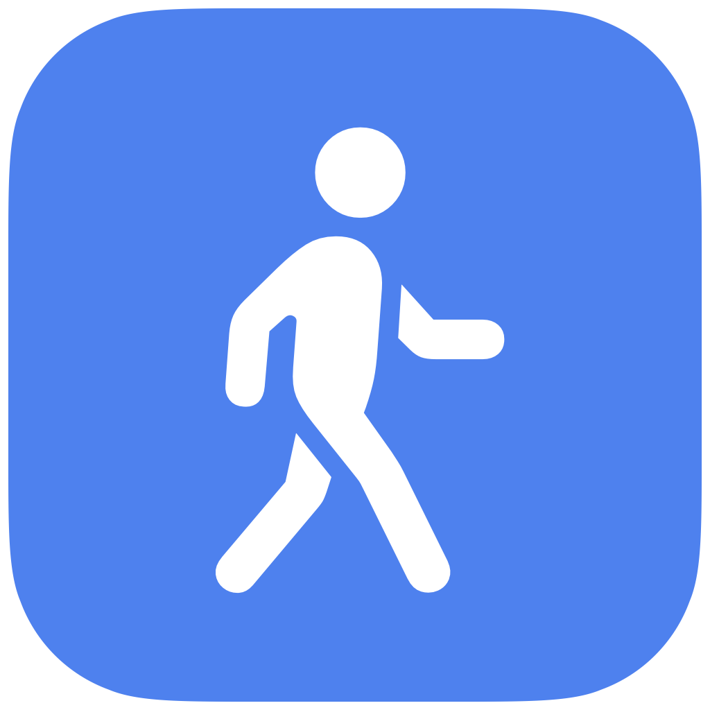
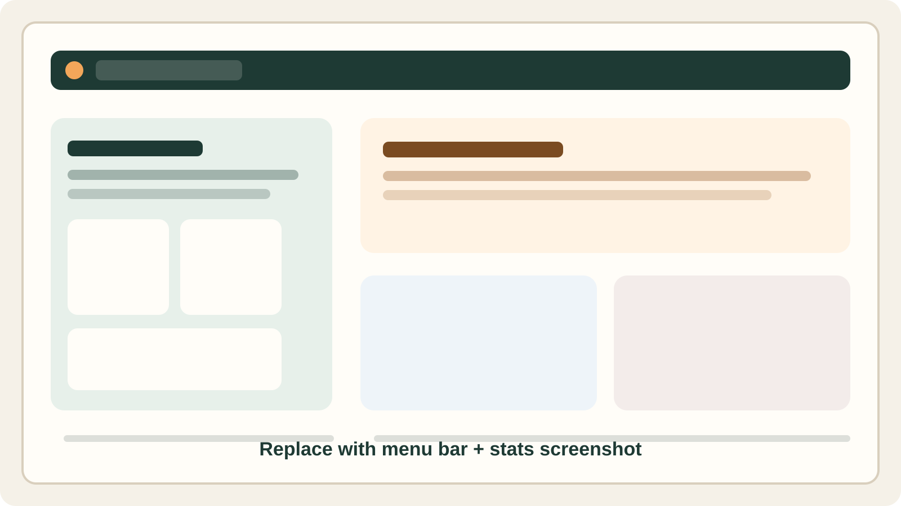
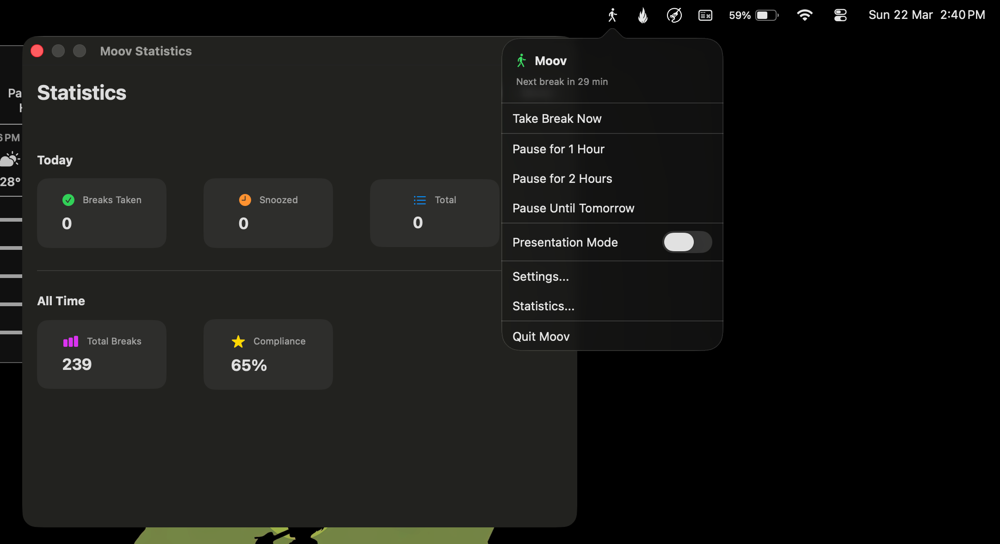
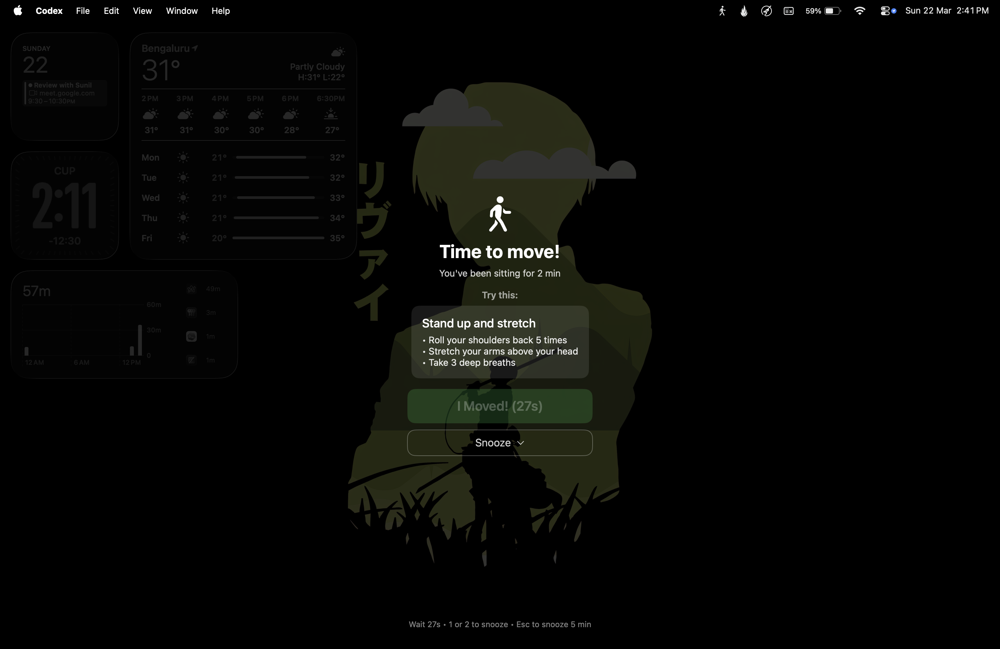
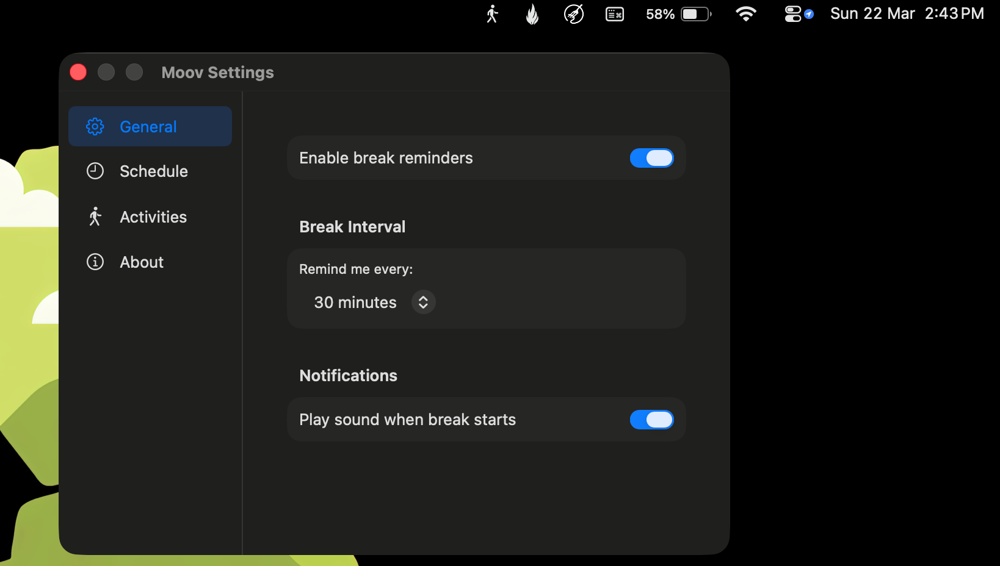

# Moov

<p align="center">
  
</p>

<p align="center">
  A focused macOS menu bar app that nudges you to stand up, stretch, and reset before long work sessions turn into all-day sitting.
</p>

<!--<p align="center">
  <!---->
  <!---->
<!--</p>-->

## Installation

1. Go to the project's **Releases** page on GitHub.
2. Download the latest `Moov.dmg` from the release assets.
3. Open the DMG and drag `Moov.app` into your `Applications` folder.
4. Open `Applications` and launch `Moov`.
5. If macOS shows a security warning the first time you open it, right-click `Moov` in `Applications`, choose `Open`, and confirm.

## Why Moov

Moov lives in your menu bar and keeps movement reminders simple:

- Regular break prompts without a full desktop app getting in the way
- A full-screen overlay that is visible enough to interrupt autopilot
- Snooze, pause, quiet hours, and presentation mode so reminders stay practical
- Lightweight statistics so you can see whether you are actually taking breaks

It is built as a native macOS app with SwiftUI, AppKit, and SwiftData, with no external dependencies.

## Screenshots

The README is set up with screenshot placeholders so real captures can be dropped in later without changing the layout.

### Break Overlay




What to capture:
- The full-screen reminder overlay
- Countdown state before "I Moved!" becomes active
- Activity suggestion card if enabled

### Settings




What to capture:
- Sidebar-based settings window
- General tab with break interval controls
- Quiet hours or activity preferences visible

### Menu Bar + Stats


What to capture:
- The menu bar dropdown with active or paused state
- The statistics window showing break totals and compliance

## Features

### Built today

- Menu bar only app with no Dock presence
- Configurable break intervals, including custom durations
- Full-screen break overlay with a short enforced countdown
- Snooze actions for 5 or 10 minutes
- Quiet hours to suppress reminders outside your work window
- Presentation mode to avoid interruptions during demos and meetings
- Optional activity suggestions during breaks
- Basic statistics for breaks taken, snoozed, and compliance rate
- SwiftData-backed break history

### Planned next

- More varied activity suggestions
- Stronger keyboard affordances during the break overlay
- Richer statistics and trend views
- Idle detection
- Calendar and health integrations

## How It Works

Moov starts in the menu bar, tracks time since your last break, and opens an overlay when it is time to move.

From the menu bar, you can:

- Trigger a break immediately
- Pause reminders for a fixed duration
- Toggle presentation mode
- Open settings
- Open statistics

During a break, you can:

- Confirm the break with "I Moved!" once the countdown completes
- Snooze for 5 or 10 minutes
- Press `Esc` for a quick 5-minute snooze

## Getting Started

### Requirements

- macOS 14.0+
- Xcode 15+

### Run locally

1. Open [Moov.xcodeproj](/Users/suchitg/gen/moov/Moov.xcodeproj) in Xcode.
2. Select the `Moov` target and choose `My Mac`.
3. Press `Cmd+R`.
4. Confirm the Moov icon appears in the macOS menu bar.

### Quick manual test

1. Open `Settings...` from the menu bar.
2. Set the break interval to `1 minute`.
3. Wait for the overlay to appear.
4. Verify `I Moved!`, snooze actions, and `Esc` behavior.

## Documentation

- Setup and build instructions: [docs/SETUP.md](/Users/suchitg/gen/moov/docs/SETUP.md)
- Feature guide: [docs/FEATURES.md](/Users/suchitg/gen/moov/docs/FEATURES.md)
- Architecture details: [docs/ARCHITECTURE.md](/Users/suchitg/gen/moov/docs/ARCHITECTURE.md)
- Development notes: [docs/CHANGELOG.md](/Users/suchitg/gen/moov/docs/CHANGELOG.md)

## Tech Stack

- SwiftUI for the app UI
- AppKit for menu bar and overlay window behavior
- SwiftData for break history persistence
- UserDefaults-backed settings for app preferences

## Packaging

To build a release DMG:

```bash
./scripts/release-dmg.sh
```

This creates a distributable DMG in the repository root.

## Project Status

Moov is already usable as a personal movement reminder app. The current focus is polishing interaction details, expanding activity content, and improving stats depth rather than changing the core workflow.
